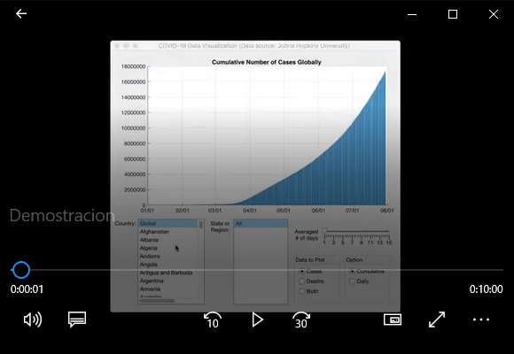

# TRABAJO DE CONSULTA - PYTHON INTERMEDIO

## Objetivos de aprendizaje
- Aplicar nuevas habilidades a un problema del mundo real
- Sintetizar las técnicas aprendidas

## Descripción
> TODO: Actualizar

SMARTSEC Node es una aplicación desarrollada en Python  que procesa información
de audio y vídeo para realizar el reconocimiento de asaltos con armas de fuego en tiempo real empleando la librería YOLO. Cuando un asalto es detectado, se genera una foto del momento y una grabación de vídeo de 10 segundos, 5 segundos antes y 5 después de la detección. Mediante Wi-Fi, se envía la información de la imagen, vídeo y fecha hacia la plataforma SMARTSEC Monitor.

## Funcionamiento
> TODO: Actualizar captura y enlace  a video en youtube

Demostración de funcionamiento

  

## Versiones y evoluciones del producto
> TODO: Completar

Versión 1.0 Octubre 2022

- Procesamiento de datos datos desde archivos CSV
- Visualización de gráficas de resultados
- ....  
